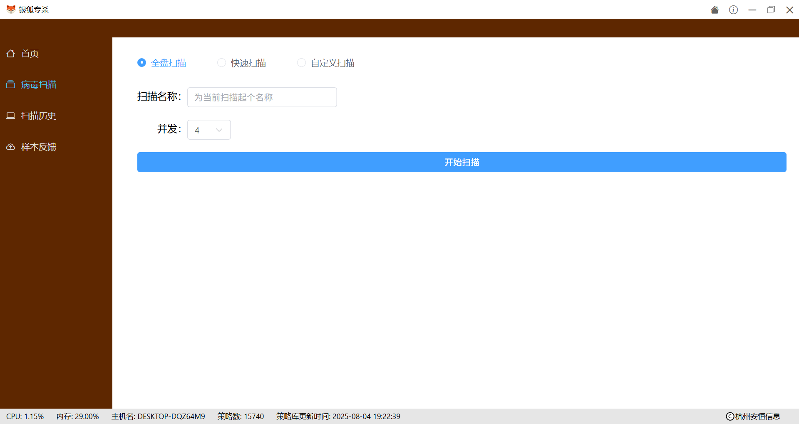
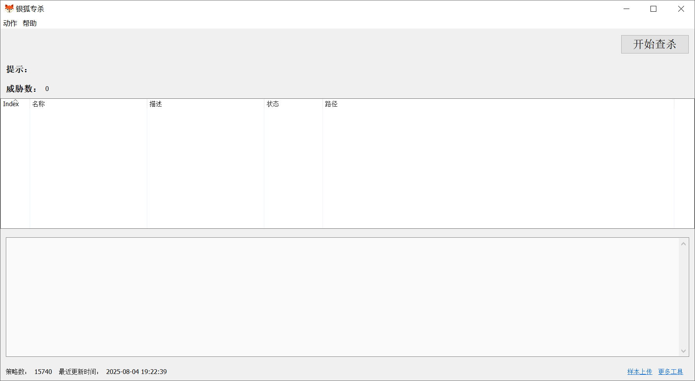

<h1 align="center">
  
</h1>

<h4 align="center">银狐专杀工具</h4>

银狐专杀工具是一款专为查杀银狐木马及其变种而打造的高效专杀工具，每间隔30分钟更新一次查杀库，依托高质量威胁情报和高性能查杀引擎，能够在1分钟内完成整机扫描与清理。

## 工具优点

+ 专项情报：依托高质量威胁情报，能够识别网络中流行的各类银狐木马变种，支持实时在线更新查杀库，确保查杀准确性和时效性。
+ 专业性强：专门针对银狐木马及其变种设计，具备高度的专业针对性，精准查杀活跃的恶意进程和潜伏的静态文件，覆盖全面。
+ 高效性能：内置高性能查杀引擎，1分钟内完成整机扫描与清理。

## 工具下载
⬇️[下载地址](https://github.com/das-secbox/silverfox_scanner/releases)

## 工具使用
工具为绿色版，解压运行即可。
* Webview2版：运行文件夹里的ah_comm_scan.exe程序启动工具
* 通用兼容版：运行文件夹里的ah_comm_scan_s.exe程序启动工具

## WebView2 安装指南
*Webview2版的工具界面依赖 Microsoft WebView2 运行时。新版本的 Windows 10 和 Windows 11 系统已预装该组件，无需手动安装。如果遇到工具运行时提示 “未安装 WebView2”，请根据您的系统环境选择对应的安装方式：*

**Windows 10（联网环境）**
只需下载微软官方提供的安装引导程序，双击运行即可自动完成安装。
👉 [点击下载Webview2安装引导程序](https://secbox.dbappsecurity.com.cn/tool/tools/resource/webview2/win10/MicrosoftEdgeWebview2Setup.exe)

**Windows 7 / 8 或 无网络环境**
请下载微软官方提供的离线安装包，在目标电脑上离线安装。
👉 [点击下载Webview2离线安装包](https://secbox.dbappsecurity.com.cn/tool/tools/resource/webview2/win7/MicrosoftEdgeWebView2RuntimeInstallerX64.exe)

## 工具展示
**Webview2版：**

**通用兼容版：**

